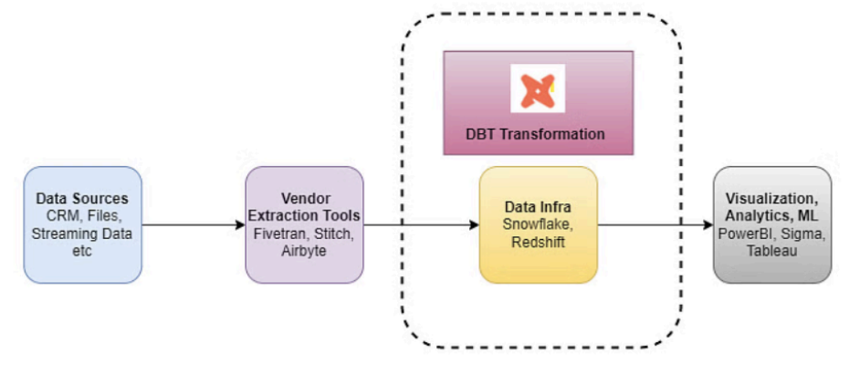

### Project Description

This project aims to provide a comprehensive understanding of the DBT (Data Build Tool). We will explore data modeling and logging, which are essential aspects of DBT. To demonstrate how DBT can be used in real-life scenarios, we will be using Netflix movies and series data stored in Snowflake. By using DBT with Snowflake, we will show how businesses can leverage these tools to solve complex data problems. Through this project, we will gain insight into the various features of DBT and how they can be used to build robust data pipelines. With this knowledge, users can learn to optimize their data transformation and modeling workflows, making them more efficient and effective for their organization's needs.

Language: Python, SQL
Tool: DBT
Database: Snowflake

Architecture Diagram:

### Resources:
- Learn more about dbt [in the docs](https://docs.getdbt.com/docs/introduction)
- Check out [Discourse](https://discourse.getdbt.com/) for commonly asked questions and answers
- Join the [chat](https://community.getdbt.com/) on Slack for live discussions and support
- Find [dbt events](https://events.getdbt.com) near you
- Check out [the blog](https://blog.getdbt.com/) for the latest news on dbt's development and best practices